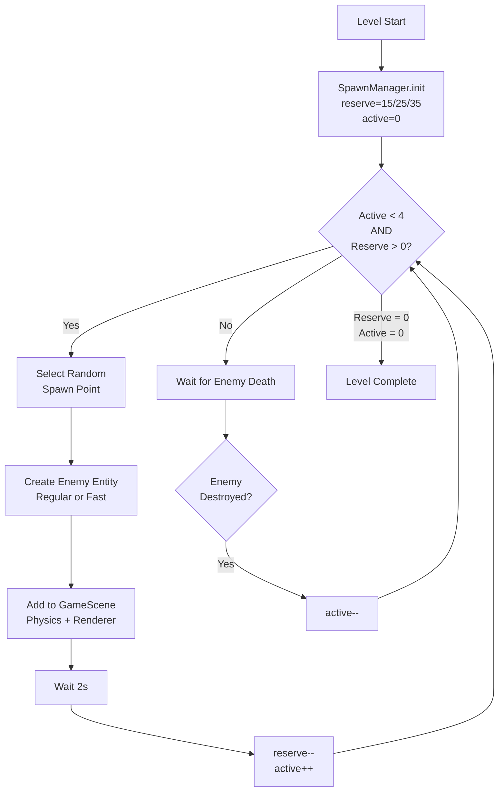
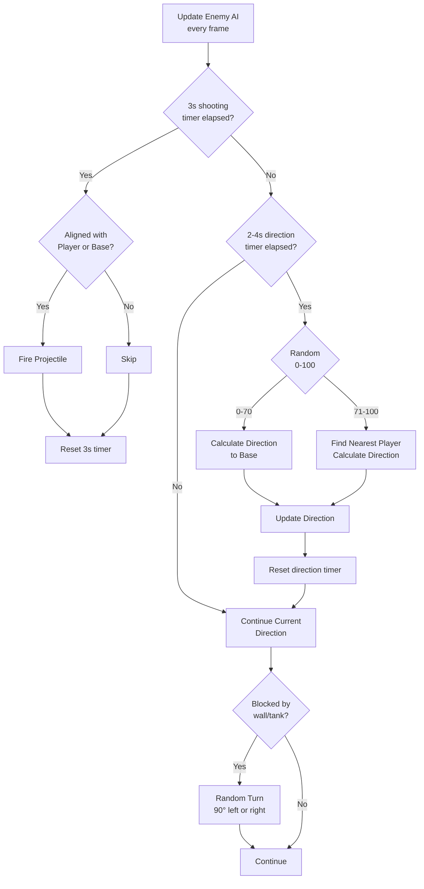

# Design Doc — Enemy Spawning & AI (US-15)

**Status:** PHASE 1 (Generated after `/approve prd`)  
**Sources:** Feature PRD, Global PRD/GDD/User Stories, existing Tank/Movement architecture

---

## 1. Overview & Goals

Implement dynamic enemy tank spawning and basic AI behavior to create combat scenarios. Enemies spawn from top-edge positions, patrol the map, prioritize the base, and shoot at players when aligned.

**Primary Goals:**
- Spawn management: enforce max 4 simultaneous enemies, manage reserve pool (15/25/35 per level)
- Spawn system: 4 top-edge spawn points with 2-second spawn delay
- Basic AI: base-priority movement (70%), player engagement (30%), shooting every 3s
- Enemy types: Regular (70% player speed), Fast (100% player speed)
- Performance: ≥30 FPS with 4 enemies + 2 players active

**Scope Boundaries:**
- **In:** Spawn manager, enemy entity, AI behavior, collision detection, HUD integration
- **Out:** Advanced pathfinding, enemy coordination, multiple enemy types (only 2 variants), animations, sound

---

## 2. Architecture

### 2.1 Clean Architecture Layers

```
┌─────────────────────────────────────────────────┐
│ Infrastructure (Phaser Integration)             │
│ - GameScene (spawn orchestration, update loop)  │
│ - SpawnPointConfig (level data)                 │
│ - HUDAdapter (enemies remaining counter)        │
└─────────────────────────────────────────────────┘
                    ↓ Uses
┌─────────────────────────────────────────────────┐
│ Application (Use Cases & Ports)                 │
│ - SpawnEnemy(spawnPointId)                      │
│ - UpdateEnemyAI(enemyId, deltaTime)             │
│ - DestroyEnemy(enemyId)                         │
│ Ports: ISpawnManager, IAI, IEnemyRenderer       │
└─────────────────────────────────────────────────┘
                    ↓ Uses
┌─────────────────────────────────────────────────┐
│ Domain (Entities & Services)                    │
│ - Enemy Entity (extends/mirrors Tank)           │
│ - SpawnManager Service (reserve, queue, limits) │
│ - EnemyAI Service (patrol, targeting, shooting) │
│ - TargetingService (base priority, alignment)   │
└─────────────────────────────────────────────────┘
```

### 2.2 Enemy Spawn Flow



### 2.3 Enemy AI Behavior Loop



---

## 3. Tech Stack & Decisions

### 3.1 Technology Choices
- **Phaser 3 Arcade Physics:** Reuse collision system from player movement
- **ES6 Modules:** Maintain consistency with existing codebase
- **Existing Tank Entity:** Extend/adapt for enemy tanks (reuse domain logic)
- **State Management:** SpawnManager tracks reserve, active enemies, spawn queue

### 3.2 Design Decisions

| Decision | Rationale |
|----------|-----------|
| **Extend Tank Entity** | Reuse position, direction, velocity logic; differentiate with `isPlayer` flag |
| **SpawnManager Service** | Centralize spawn logic, enforce limits, manage lifecycle |
| **EnemyAI Service** | Pure domain logic for targeting, decision-making (testable) |
| **2-second spawn delay** | Prevent simultaneous spawns, give players reaction time |
| **70/30 base/player priority** | Creates urgency (base defense) while maintaining player engagement |
| **Direction change timer (2-4s)** | Prevents predictable patterns, adds variance |
| **Fast enemy type** | Introduces challenge scaling, differentiates late-game waves |

---

## 4. Data Models

### 4.1 Enemy Entity (Domain)

```javascript
/**
 * Enemy Entity — extends/mirrors Tank
 * 
 * @class Enemy
 * @extends Tank
 */
class Enemy {
  constructor(id, spawnPosition, type = 'regular') {
    const speed = type === 'fast' ? 120 : 84; // fast=100%, regular=70%
    super(id, spawnPosition, speed);
    
    this.type = type; // 'regular' | 'fast'
    this.isPlayer = false;
    this.targetPriority = 'base'; // 'base' | 'player'
    this.lastShotTime = 0;
    this.lastDirectionChangeTime = 0;
    this.directionChangeInterval = this._randomInterval(2000, 4000); // ms
  }
  
  _randomInterval(min, max) {
    return Math.random() * (max - min) + min;
  }
}
```

### 4.2 SpawnManager Service (Domain)

```javascript
/**
 * SpawnManager — manages enemy spawning lifecycle
 * 
 * @class SpawnManager
 */
class SpawnManager {
  constructor(levelConfig) {
    this.totalReserve = levelConfig.enemyCount; // 15/25/35
    this.remainingReserve = this.totalReserve;
    this.activeEnemies = []; // array of Enemy entities
    this.maxSimultaneous = 4;
    this.spawnPoints = levelConfig.spawnPoints; // [{x, y, id}]
    this.lastSpawnTime = 0;
    this.spawnDelay = 2000; // ms
  }
  
  canSpawn(currentTime) {
    const hasReserve = this.remainingReserve > 0;
    const underLimit = this.activeEnemies.length < this.maxSimultaneous;
    const delayElapsed = (currentTime - this.lastSpawnTime) >= this.spawnDelay;
    return hasReserve && underLimit && delayElapsed;
  }
  
  getRandomSpawnPoint() {
    const index = Math.floor(Math.random() * this.spawnPoints.length);
    return this.spawnPoints[index];
  }
  
  spawnEnemy(currentTime) {
    if (!this.canSpawn(currentTime)) return null;
    
    const spawnPoint = this.getRandomSpawnPoint();
    const type = this._determineEnemyType();
    const enemy = new Enemy(`E${Date.now()}`, spawnPoint, type);
    
    this.activeEnemies.push(enemy);
    this.remainingReserve--;
    this.lastSpawnTime = currentTime;
    
    return enemy;
  }
  
  removeEnemy(enemyId) {
    this.activeEnemies = this.activeEnemies.filter(e => e.id !== enemyId);
  }
  
  _determineEnemyType() {
    // Simple rule: 75% regular, 25% fast
    return Math.random() < 0.75 ? 'regular' : 'fast';
  }
  
  getRemainingCount() {
    return this.remainingReserve + this.activeEnemies.length;
  }
}
```

### 4.3 EnemyAI Service (Domain)

```javascript
/**
 * EnemyAI Service — decision-making and behavior logic
 * 
 * @class EnemyAI
 */
class EnemyAI {
  constructor(targetingService) {
    this.targetingService = targetingService;
    this.shootingInterval = 3000; // ms
  }
  
  /**
   * Update enemy behavior
   * @param {Enemy} enemy
   * @param {number} currentTime
   * @param {object} gameState - { basePosition, players: [] }
   * @returns {{ direction: string, shouldShoot: boolean }}
   */
  update(enemy, currentTime, gameState) {
    const decisions = { direction: enemy.direction, shouldShoot: false };
    
    // Check shooting timer
    if (currentTime - enemy.lastShotTime >= this.shootingInterval) {
      const aligned = this.targetingService.isAlignedWithTarget(
        enemy.position, 
        gameState.basePosition, 
        gameState.players
      );
      if (aligned) {
        decisions.shouldShoot = true;
        enemy.lastShotTime = currentTime;
      }
    }
    
    // Check direction change timer
    if (currentTime - enemy.lastDirectionChangeTime >= enemy.directionChangeInterval) {
      const priority = Math.random();
      
      if (priority < 0.7) {
        // Move toward base (70%)
        decisions.direction = this.targetingService.getDirectionToTarget(
          enemy.position, 
          gameState.basePosition
        );
      } else {
        // Move toward nearest player (30%)
        const nearestPlayer = this.targetingService.getNearestPlayer(
          enemy.position, 
          gameState.players
        );
        decisions.direction = this.targetingService.getDirectionToTarget(
          enemy.position, 
          nearestPlayer.position
        );
      }
      
      enemy.lastDirectionChangeTime = currentTime;
      enemy.directionChangeInterval = this._randomInterval(2000, 4000);
    }
    
    return decisions;
  }
  
  _randomInterval(min, max) {
    return Math.random() * (max - min) + min;
  }
}
```

### 4.4 TargetingService (Domain)

```javascript
/**
 * TargetingService — calculates directions and alignment
 * 
 * @class TargetingService
 */
class TargetingService {
  /**
   * Calculate cardinal direction from source to target
   * @param {{x: number, y: number}} source
   * @param {{x: number, y: number}} target
   * @returns {'up' | 'down' | 'left' | 'right'}
   */
  getDirectionToTarget(source, target) {
    const dx = target.x - source.x;
    const dy = target.y - source.y;
    
    // Prefer horizontal or vertical based on larger delta
    if (Math.abs(dx) > Math.abs(dy)) {
      return dx > 0 ? 'right' : 'left';
    } else {
      return dy > 0 ? 'down' : 'up';
    }
  }
  
  /**
   * Check if enemy is aligned (same row/column) with any target
   * @param {{x: number, y: number}} enemyPos
   * @param {{x: number, y: number}} basePos
   * @param {Array<{position: {x, y}}>} players
   * @returns {boolean}
   */
  isAlignedWithTarget(enemyPos, basePos, players) {
    const threshold = 32; // tile size alignment tolerance
    
    // Check base alignment
    const baseAligned = (
      Math.abs(enemyPos.x - basePos.x) < threshold ||
      Math.abs(enemyPos.y - basePos.y) < threshold
    );
    if (baseAligned) return true;
    
    // Check player alignment
    for (const player of players) {
      const aligned = (
        Math.abs(enemyPos.x - player.position.x) < threshold ||
        Math.abs(enemyPos.y - player.position.y) < threshold
      );
      if (aligned) return true;
    }
    
    return false;
  }
  
  /**
   * Find nearest player to enemy
   * @param {{x: number, y: number}} enemyPos
   * @param {Array<{position: {x, y}}>} players
   * @returns {{position: {x, y}}}
   */
  getNearestPlayer(enemyPos, players) {
    let nearest = players[0];
    let minDist = Infinity;
    
    for (const player of players) {
      const dist = this._distance(enemyPos, player.position);
      if (dist < minDist) {
        minDist = dist;
        nearest = player;
      }
    }
    
    return nearest;
  }
  
  _distance(pos1, pos2) {
    const dx = pos2.x - pos1.x;
    const dy = pos2.y - pos1.y;
    return Math.sqrt(dx * dx + dy * dy);
  }
}
```

---

## 5. APIs / Interfaces

### 5.1 Port Interfaces (Application Layer)

```javascript
/**
 * ISpawnManager — Spawn lifecycle management
 */
class ISpawnManager {
  canSpawn(currentTime) {}
  spawnEnemy(currentTime) {}
  removeEnemy(enemyId) {}
  getRemainingCount() {}
  getActiveEnemies() {}
}

/**
 * IAI — Enemy behavior decisions
 */
class IAI {
  update(enemy, currentTime, gameState) {}
}

/**
 * IEnemyRenderer — Rendering adapter for enemies
 */
class IEnemyRenderer {
  createEnemy(enemy) {}
  updateEnemy(enemy, direction, velocity) {}
  removeEnemy(enemyId) {}
}
```

### 5.2 Use Cases (Application Layer)

```javascript
/**
 * SpawnEnemy Use Case
 */
class SpawnEnemy {
  constructor(spawnManager, enemyRenderer, physics) {
    this.spawnManager = spawnManager;
    this.enemyRenderer = enemyRenderer;
    this.physics = physics;
  }
  
  execute(currentTime) {
    const enemy = this.spawnManager.spawnEnemy(currentTime);
    if (!enemy) return null;
    
    this.enemyRenderer.createEnemy(enemy);
    this.physics.enableBody(enemy.id, enemy.position);
    
    return enemy;
  }
}

/**
 * UpdateEnemyAI Use Case
 */
class UpdateEnemyAI {
  constructor(enemyAI, movementService, enemyRenderer, projectileSystem) {
    this.enemyAI = enemyAI;
    this.movementService = movementService;
    this.enemyRenderer = enemyRenderer;
    this.projectileSystem = projectileSystem;
  }
  
  execute(enemy, currentTime, gameState) {
    const decisions = this.enemyAI.update(enemy, currentTime, gameState);
    
    // Update movement
    const velocity = this.movementService.calculateVelocity(
      decisions.direction, 
      enemy.speed
    );
    this.enemyRenderer.updateEnemy(enemy, decisions.direction, velocity);
    
    // Handle shooting
    if (decisions.shouldShoot) {
      this.projectileSystem.fireProjectile(enemy.id, enemy.position, enemy.direction);
    }
  }
}

/**
 * DestroyEnemy Use Case
 */
class DestroyEnemy {
  constructor(spawnManager, enemyRenderer, physics, hud) {
    this.spawnManager = spawnManager;
    this.enemyRenderer = enemyRenderer;
    this.physics = physics;
    this.hud = hud;
  }
  
  execute(enemyId) {
    this.spawnManager.removeEnemy(enemyId);
    this.enemyRenderer.removeEnemy(enemyId);
    this.physics.disableBody(enemyId);
    this.hud.updateEnemiesRemaining(this.spawnManager.getRemainingCount());
  }
}
```

---

## 6. Integration with Existing Systems

### 6.1 GameScene Updates

```javascript
class GameScene extends Phaser.Scene {
  create() {
    // Initialize spawn system
    const levelConfig = {
      enemyCount: 15, // from level JSON
      spawnPoints: [
        { x: 100, y: 50, id: 'SP1' },
        { x: 300, y: 50, id: 'SP2' },
        { x: 500, y: 50, id: 'SP3' },
        { x: 700, y: 50, id: 'SP4' }
      ]
    };
    
    this.spawnManager = new SpawnManager(levelConfig);
    this.enemyAI = new EnemyAI(new TargetingService());
    this.spawnEnemyUseCase = new SpawnEnemy(
      this.spawnManager, 
      this.enemyRenderer, 
      this.physics
    );
    this.updateEnemyAIUseCase = new UpdateEnemyAI(
      this.enemyAI,
      this.movementService,
      this.enemyRenderer,
      this.projectileSystem
    );
  }
  
  update(time, delta) {
    // Player movement (existing)
    this.handlePlayerInput();
    
    // Enemy spawning
    this.spawnEnemyUseCase.execute(time);
    
    // Enemy AI updates
    const gameState = {
      basePosition: this.basePosition,
      players: [this.p1Tank, this.p2Tank].filter(p => p.isAlive)
    };
    
    for (const enemy of this.spawnManager.getActiveEnemies()) {
      this.updateEnemyAIUseCase.execute(enemy, time, gameState);
    }
  }
}
```

### 6.2 Collision Handling

Reuse existing collision system from player movement:
- Enemy-to-wall collisions (blocks movement)
- Enemy-to-water collisions (blocks movement)
- Enemy-to-tank collisions (blocks movement)
- Projectile-to-enemy collisions (handled by projectile system)

---

## 7. Non-Functional Requirements

### 7.1 Performance
- **Target:** ≥30 FPS with 4 enemies + 2 players + projectiles active
- **Optimization strategies:**
  - Limit AI updates to active enemies only
  - Use spatial partitioning for collision checks (Phaser Arcade built-in)
  - Cache direction calculations (2-4s interval)
  - Pool enemy sprites (reuse destroyed enemies)

### 7.2 Testability
- **Unit Tests:**
  - Enemy entity state management
  - SpawnManager spawning logic, reserve tracking
  - EnemyAI decision-making (70/30 priority, shooting timing)
  - TargetingService direction/alignment calculations
- **Integration Tests:**
  - Spawn flow (reserve → active → destroyed → respawn)
  - AI behavior in GameScene (movement, shooting, collision)
  - HUD synchronization (enemies remaining counter)

### 7.3 Maintainability
- Pure domain logic in services (no Phaser dependencies)
- Port interfaces for adapters (testable in isolation)
- Clear separation: spawn management vs AI behavior vs rendering

---

## 8. Risks & Mitigations

| Risk | Likelihood | Impact | Mitigation |
|------|------------|--------|------------|
| AI gets stuck in corners/loops | High | Medium | Implement collision-detection → random turn logic; reset direction timer on collision |
| Performance drops with 4 enemies | Medium | High | Profile early; limit AI update frequency (e.g., every 2-3 frames); optimize collision checks |
| Spawn points blocked by map changes | Low | Medium | Validate spawn points in level config; add spawn-blocking detection |
| Enemies clump together | Medium | Low | Add slight randomization to spawn timing (±0.5s); future: collision avoidance |

---

## 9. Testing Strategy

### 9.1 Unit Tests
- `Enemy.js`: constructor, setDirection, state updates
- `SpawnManager.js`: canSpawn, spawnEnemy, removeEnemy, reserve tracking
- `EnemyAI.js`: decision logic (70/30 split), shooting timer, direction changes
- `TargetingService.js`: getDirectionToTarget, isAlignedWithTarget, getNearestPlayer

### 9.2 Integration Tests
- Spawn flow: reserve decrements, active increments, respawn after death
- AI behavior: enemies move toward base, shoot when aligned, change directions
- Collision: enemies blocked by walls/water/tanks
- HUD: enemies remaining counter updates correctly

### 9.3 Performance Tests
- 4 enemies + 2 players moving simultaneously: ≥30 FPS
- All enemies shooting + moving: no frame drops
- 10-second stress test: stable framerate

---

## 10. Implementation Phases (Preview)

1. **Domain Layer:** Enemy entity, SpawnManager, EnemyAI, TargetingService
2. **Application Layer:** Use cases (SpawnEnemy, UpdateEnemyAI, DestroyEnemy), port interfaces
3. **Adapters:** EnemySpriteAdapter (rendering), integrate with existing physics/input
4. **Infrastructure:** GameScene integration, spawn point config, HUD updates
5. **Testing:** Unit tests → Integration tests → Performance QA
6. **Demo:** Standalone enemy demo page + full GameScene integration

---

**Next Steps:**
- User runs `/approve design` to move to PHASE 2 (Task Breakdown)
