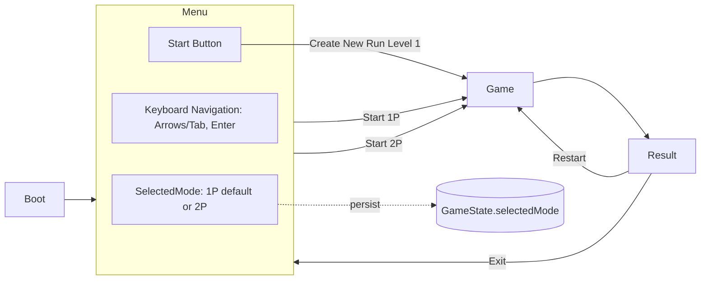

# Design Doc — Menu: 1P/2P Start (US-01, US-02)

Status: PHASE 1 (Generated after `/approve prd`)
Sources: Feature PRD, Global PRD/GDD/User Stories

## 1. Overview & Goals
- Provide a keyboard-only Start Menu to select 1P (default) or 2P and start at Level 1.
- Preserve the selected mode when restarting from the Result screen.
- Keep UI minimal and performant; align with 30 FPS target.

Scope boundaries:
- In: Menu navigation, mode selection, Start action, mode persistence across Restart.
- Out: Audio, mouse/touch/gamepad, pause, save/load, Edge/mobile.

## 2. Architecture

### 2.1 Scenes and Flow
- Scenes: `Boot` → `Menu` → `Game` → `Result`.
- The `Menu` scene owns local UI state; the `GameState` (in-memory) stores `selectedMode` to survive scene transitions and Restarts.

### 2.2 Ports and Adapters used
- `IInput` (KeyboardInputAdapter): arrows/Tab/Shift+Tab for navigation; Enter to confirm.
- `IRenderer`/UI: simple text/buttons; highlight focused option; optional background sprite.
- `IHUD` (indirect via Game start): HUD reflects lives for P1/P2 and Level 1 on load.
- `ILevelRepository`: loads Level 1 config when starting.

### 2.3 Mermaid (Feature flow)


## 3. Tech Stack & Decisions
- Tech: HTML5/CSS/JS, Phaser 3.
- Keep menu UI minimal (text options or basic buttons) to avoid layout jank.
- Deterministic focus order for keyboard-only navigation; visible focus highlight.
- Store `selectedMode` in global `GameState` (in-memory object) to persist across scenes.
- On Start, dispatch `StartGame` use case with `selectedMode` and `levelId=1`.

## 4. Data Models / APIs

### 4.1 GameState (in-memory)
```ts
type PlayerMode = "1P" | "2P";
interface GameState {
	selectedMode: PlayerMode; // default "1P"
}
```

### 4.2 Menu ViewModel
```ts
interface MenuViewModel {
	options: Array<{ id: "1P"|"2P"|"START"; label: string; focused: boolean }>;
	selectedMode: PlayerMode;
}
```

### 4.3 Use Cases
- `SelectMode(mode: PlayerMode)`: updates `GameState.selectedMode` and menu VM.
- `StartGame(mode: PlayerMode, levelId: 1)`: transitions to Game scene and triggers level load and HUD init.
- `RestartGame()`: reloads Level 1 using `GameState.selectedMode`.

### 4.4 Input Mapping (Menu)
- Arrows or Tab/Shift+Tab: move focus between `1P`, `2P`, `START`.
- Enter: if focus is on `1P`/`2P`, select mode; if on `START`, call `StartGame`.

## 5. Non-Functional Requirements
- Performance: maintain ≥30 FPS on menu and first 10s of Level 1.
- Compatibility: desktop Chrome/Firefox/Safari; keyboard only.
- Reliability: no critical console errors on scene transitions.
- Accessibility: clear focus indicator; deterministic tab order.

## 6. Acceptance Mapping (US-01/US-02)
- Default mode `1P` focused; `START` enabled.
- Navigation via keyboard only; Enter confirms.
- Start loads Level 1; P1/P2 spawned per mode; HUD shows Level 1 and 15 enemies.
- Restart from Result keeps last `selectedMode`.

## 7. Test Strategy (high level)
- Unit: `SelectMode` updates state; `StartGame` passes correct DTO to Game scene.
- Integration (scenes): focus traversal order; Enter on focused option triggers expected action.
- E2E smoke: Menu → Start → Game Level 1 loads; Result → Restart keeps mode.

## 8. Open Items
- Visual style minimal for MVP; can iterate later.
- Labels EN vs ES; default to English per repo conventions.
