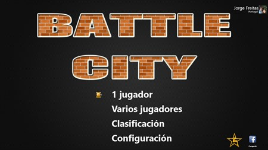

# Feature PRD — Menu: 1P/2P Start (US-01, US-02)

Owner: Product Owner
Version: 0.1 (Draft for intake)
Status: Pending approval (/approve prd)
Sources: ../prd.md, ../gdd.md, ../user-stories.md

## 1. Vision & Objective
Enable players to select 1 or 2 players from the Start Menu and begin a new game at Level 1, aligning with the MVP scope and desktop-only constraints. Modern design but minimalistic, focused on functionality and performance.

## 1.1 Image reference for menu

## 2. In Scope (MVP)
- Start Menu with keyboard-only navigation.
- Mode selection: 1 Player (default) or 2 Players.
- "Start" action starts Level 1.
- Preserve selected mode when restarting from Result screen.
- HUD reflects mode and lives on start.

## 3. Out of Scope (MVP)
- Audio, gamepad, mouse/touch interaction.
- Save/load, pause system, mobile/Edge support.

## 4. User Stories Covered
- US-01 — Select 1P or 2P on Start Menu.
- US-02 — Start new game in Level 1 (keep mode on restart).

## 5. User Flows (High Level)
- Start Menu → Select 1P/2P → Start → Load Level 1 → Spawn players → HUD shows mode/level/enemy count.
- Result screen → Restart → Load Level 1 with previously selected mode.

## 6. Acceptance Criteria (Summary)
- Default selection is "1 Player"; Start enabled.
- Keyboard-only navigation (Tab/Shift+Tab or Arrows) and Enter to confirm.
- Starting loads Level 1 with P1 (and P2 if 2P) at spawn points; each with 3 lives.
- HUD shows Level 1 and 15 enemies remaining.
- Restart from Result returns to Level 1 and preserves selected mode.
- Performance: ≥30 FPS for first 10s after start on desktop Chrome/Firefox/Safari.

## 7. Non-Functional Requirements
- Desktop browsers only (Chrome/Firefox/Safari). Keyboard only.
- No critical console errors. Stable 30 FPS at start.

## 8. Dependencies
- Input mapping (keyboard), level loader, spawns, HUD.
- Result screen restart signaling.

## 9. Risks & Mitigations
- Risk: Menu focus handling with only keyboard. Mitigation: clear focus ring and deterministic order.
- Risk: Mode persistence across Restart. Mitigation: store mode in in-memory game state.

## 10. Open Questions
- Visual style and focus states for Start Menu (OK to keep minimal MVP?).
- Localization for menu labels (EN/ES?).

## 11. Definition of Done (DoD)
- All acceptance criteria pass.
- Keyboard-only navigation verified.
- Mode persisted on restart.
- Tested on Chrome/Firefox/Safari desktop.

## 12. Traceability
- PRD Sections: 2, 5.1, 6.1–6.4, 8
- GDD Sections: 7 (Controls), 17 (Spawns), 18 (Parameters)
- User Stories: US-01, US-02
