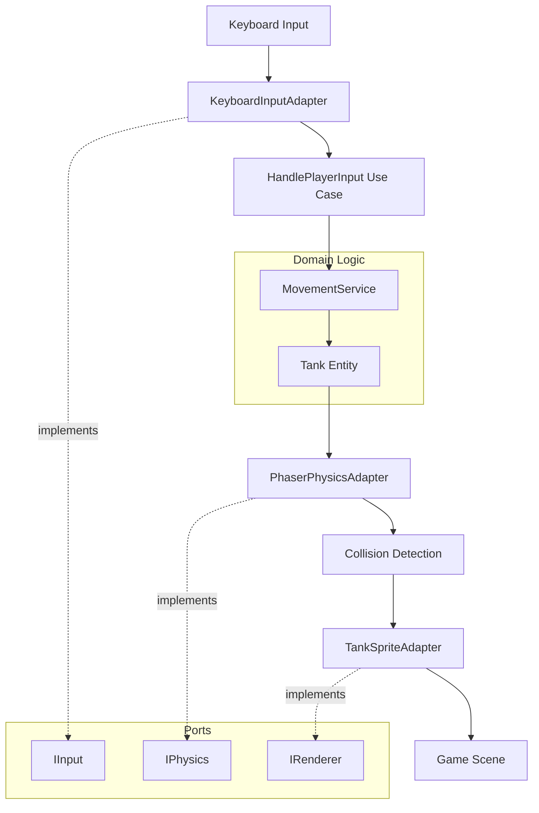

# Design Doc — Player Movement (US-03, US-04)

**Status:** PHASE 1 (Generated after `/approve prd`)  
**Sources:** Feature PRD, Global PRD/GDD/User Stories

---

## 1. Overview & Goals

Implement keyboard-controlled tank movement for Player 1 (WASD) and Player 2 (Arrow keys) with 4-directional movement, collision detection, and physics integration. This forms the core gameplay foundation enabling player interaction with the battlefield.

**Primary Goals:**
- Responsive keyboard input handling for P1 and P2
- Smooth 4-directional movement (no diagonals)
- Accurate collision detection with map tiles and entities
- Tank rotation matching movement direction
- Performance: ≥30 FPS with both players moving simultaneously

**Scope Boundaries:**
- **In:** Input handling, movement logic, collision detection, rotation, physics integration
- **Out:** Shooting, enemy AI, animations, sound, power-ups, gamepad support

---

## 2. Architecture

### 2.1 Clean Architecture Layers

```
┌─────────────────────────────────────────────────┐
│ Infrastructure (Phaser Adapters)                │
│ - KeyboardInputAdapter (IInput)                 │
│ - PhaserPhysicsAdapter (IPhysics)               │
│ - TankSpriteAdapter (IRenderer)                 │
└─────────────────────────────────────────────────┘
                    ↓ Implements
┌─────────────────────────────────────────────────┐
│ Application (Use Cases & Ports)                 │
│ - MovePlayer(playerId, direction)               │
│ - HandlePlayerInput()                           │
│ Ports: IInput, IPhysics, IRenderer              │
└─────────────────────────────────────────────────┘
                    ↓ Uses
┌─────────────────────────────────────────────────┐
│ Domain (Entities & Logic)                       │
│ - Tank Entity (position, direction, velocity)   │
│ - MovementService (direction logic, speed calc) │
│ - CollisionRules (solid tiles, boundaries)      │
└─────────────────────────────────────────────────┘
```

### 2.2 Component Flow



### 2.3 Game Loop Integration

```
GameScene.update(time, delta):
  1. Poll input state (W/A/S/D and Arrows)
  2. HandlePlayerInput(P1) → determine direction
  3. HandlePlayerInput(P2) → determine direction (if 2P)
  4. MovePlayer(P1, direction) → update velocity
  5. MovePlayer(P2, direction) → update velocity (if 2P)
  6. Phaser physics step (automatic collision resolution)
  7. Update sprite rotation based on direction
  8. Render frame
```

---

## 3. Tech Stack & Decisions

### 3.1 Technology Choices
- **Phaser 3 Arcade Physics:** Built-in collision detection, velocity-based movement
- **ES6 Modules:** Browser-compatible, clean imports
- **TypeScript-style Interfaces:** Document ports in JSDoc for type safety
- **Event-driven:** Collision events for special interactions (future extensibility)

### 3.2 Key Design Decisions

| Decision | Choice | Rationale |
|----------|--------|-----------|
| Movement Model | Velocity-based | Phaser Arcade Physics standard; smooth frame-independent movement |
| Diagonal Prevention | Last-key-pressed priority | Simple, intuitive; matches classic tank games |
| Collision Method | Phaser Colliders + body.immovable | Leverages engine; performant; declarative |
| Rotation | Discrete angles (0°, 90°, 180°, 270°) | Tank game aesthetic; no sprite interpolation needed |
| Speed Config | Constant 120 px/s | Balanced for 512x512 map; easily tunable |
| Grid Alignment | Free movement (no snap) | Smooth gameplay; collision handles boundaries |

---

## 4. Data Models / APIs

### 4.1 Domain Entities

```typescript
// Tank Entity (Domain)
class Tank {
  constructor(id: 'P1' | 'P2', spawnPosition: Position) {
    this.id = id;
    this.position = spawnPosition;
    this.direction = 'up'; // Default facing
    this.speed = 120; // px/s
    this.isAlive = true;
  }
  
  setDirection(direction: Direction): void
  getVelocity(): Velocity
  rotate(angle: number): void
}

type Direction = 'up' | 'down' | 'left' | 'right' | 'idle';
type Position = { x: number; y: number };
type Velocity = { x: number; y: number };
```

### 4.2 Ports (Interfaces)

```typescript
// IInput Port
interface IInput {
  isKeyDown(key: string): boolean;
  getActiveKeys(): string[];
}

// IPhysics Port
interface IPhysics {
  setVelocity(entityId: string, velocity: Velocity): void;
  enableCollision(entityA: string, entityB: string): void;
  onCollide(entityA: string, entityB: string, callback: Function): void;
}

// IRenderer Port  
interface IRenderer {
  setRotation(entityId: string, angle: number): void;
  setPosition(entityId: string, position: Position): void;
}
```

### 4.3 Use Cases

```typescript
// HandlePlayerInput Use Case
function HandlePlayerInput(
  playerId: 'P1' | 'P2',
  inputPort: IInput
): Direction {
  const keyMap = playerId === 'P1'
    ? { up: 'W', down: 'S', left: 'A', right: 'D' }
    : { up: 'ArrowUp', down: 'ArrowDown', left: 'ArrowLeft', right: 'ArrowRight' };
  
  // Last-key-pressed logic to prevent diagonals
  if (inputPort.isKeyDown(keyMap.up)) return 'up';
  if (inputPort.isKeyDown(keyMap.down)) return 'down';
  if (inputPort.isKeyDown(keyMap.left)) return 'left';
  if (inputPort.isKeyDown(keyMap.right)) return 'right';
  return 'idle';
}

// MovePlayer Use Case
function MovePlayer(
  tank: Tank,
  direction: Direction,
  physicsPort: IPhysics,
  renderPort: IRenderer
): void {
  const velocity = calculateVelocity(direction, tank.speed);
  physicsPort.setVelocity(tank.id, velocity);
  
  if (direction !== 'idle') {
    const angle = directionToAngle(direction);
    renderPort.setRotation(tank.id, angle);
    tank.setDirection(direction);
  }
}
```

### 4.4 Input Mapping

| Player | Up | Down | Left | Right | Shoot (future) |
|--------|----|----|------|-------|----------------|
| P1 | W | S | A | D | V |
| P2 | ↑ | ↓ | ← | → | L |

### 4.5 Collision Matrix

| Entity | Brick | Steel | Water | Bush | Base | P1 | P2 | Boundary |
|--------|-------|-------|-------|------|------|----|----|----------|
| P1 Tank | ✓ | ✓ | ✓ | ✗ | ✓ | — | ✓ | ✓ |
| P2 Tank | ✓ | ✓ | ✓ | ✗ | ✓ | ✓ | — | ✓ |

✓ = Solid collision  
✗ = Pass through

---

## 5. Non-Functional Requirements

### 5.1 Performance
- **Target:** ≥30 FPS with both players moving simultaneously
- **Collision Checks:** O(n) per frame using Phaser spatial partitioning
- **Input Polling:** Per-frame (Phaser standard, ~16ms at 60 FPS)

### 5.2 Compatibility
- **Browsers:** Chrome, Firefox, Safari (desktop)
- **Input:** Keyboard only
- **Not Supported:** Edge, mobile, gamepad

### 5.3 Maintainability
- Clear port interfaces for testing
- Decoupled domain logic from Phaser
- Unit testable movement calculations
- Integration tests with Phaser physics

### 5.4 Accessibility
- Keyboard-only control (no mouse required)
- Responsive input (<100ms latency)
- Visual feedback (tank rotation indicates direction)

---

## 6. Implementation Details

### 6.1 Movement Calculation

```javascript
function calculateVelocity(direction, speed) {
  const velocityMap = {
    'up':    { x: 0,     y: -speed },
    'down':  { x: 0,     y: speed },
    'left':  { x: -speed, y: 0 },
    'right': { x: speed,  y: 0 },
    'idle':  { x: 0,     y: 0 }
  };
  return velocityMap[direction];
}

function directionToAngle(direction) {
  const angleMap = {
    'up': 0,
    'right': 90,
    'down': 180,
    'left': 270
  };
  return angleMap[direction];
}
```

### 6.2 Collision Setup (Phaser)

```javascript
// In GameScene.create()
this.physics.add.collider(this.player1, this.brickLayer);
this.physics.add.collider(this.player1, this.steelLayer);
this.physics.add.collider(this.player1, this.waterLayer);
this.physics.add.collider(this.player1, this.baseSprite);
this.physics.add.collider(this.player1, this.player2); // P1-P2 collision

// Repeat for player2 if in 2P mode
```

### 6.3 Diagonal Prevention Logic

```javascript
// Last-key-pressed approach
class InputState {
  constructor() {
    this.keys = {};
    this.lastPressed = null;
  }
  
  update(keyboardState) {
    for (const key of ['W', 'A', 'S', 'D']) {
      if (keyboardState.isKeyDown(key) && !this.keys[key]) {
        this.lastPressed = key;
      }
      this.keys[key] = keyboardState.isKeyDown(key);
    }
  }
  
  getDirection() {
    if (!this.keys[this.lastPressed]) {
      // Last key released, check for any active key
      if (this.keys['W']) return 'up';
      if (this.keys['S']) return 'down';
      if (this.keys['A']) return 'left';
      if (this.keys['D']) return 'right';
      return 'idle';
    }
    return keyToDirection(this.lastPressed);
  }
}
```

---

## 7. Test Strategy

### 7.1 Unit Tests
- `MovementService.calculateVelocity()` → correct velocity vectors
- `directionToAngle()` → correct rotation angles
- `Tank.setDirection()` → state updates correctly
- Input mapping → correct key-to-direction translation

### 7.2 Integration Tests
- P1 WASD movement in all 4 directions
- P2 Arrow movement in all 4 directions
- Collision with brick/steel/water/base stops movement
- P1-P2 collision prevents overlap
- Bush allows traversal
- Tank rotation matches direction
- No diagonal movement possible (simultaneous key press)

### 7.3 Performance Tests
- Measure FPS with both players moving continuously
- Verify ≥30 FPS for 10 seconds
- Monitor collision checks per frame (should be <20)

### 7.4 Manual QA
- Feel test: responsive controls, smooth movement
- Visual: correct rotation, no jittering
- Edge cases: rapid key changes, boundary collision

---

## 8. File Structure

```
tankDefender-MAAC/
├── src/
│   ├── domain/
│   │   ├── entities/
│   │   │   └── Tank.js
│   │   └── services/
│   │       └── MovementService.js
│   ├── application/
│   │   ├── ports/
│   │   │   ├── IInput.js
│   │   │   ├── IPhysics.js
│   │   │   └── IRenderer.js
│   │   └── use-cases/
│   │       ├── HandlePlayerInput.js
│   │       └── MovePlayer.js
│   ├── adapters/
│   │   ├── input/
│   │   │   └── KeyboardInputAdapter.js
│   │   ├── physics/
│   │   │   └── PhaserPhysicsAdapter.js
│   │   └── rendering/
│   │       └── TankSpriteAdapter.js
│   └── infrastructure/
│       └── scenes/
│           └── GameScene.js (update existing)
├── tests/
│   ├── unit/
│   │   ├── movement/
│   │   │   ├── movementService.test.js
│   │   │   └── tank.test.js
│   │   └── input/
│   │       └── inputMapping.test.js
│   └── integration/
│       └── movement/
│           ├── playerMovement.test.js
│           └── collision.test.js
└── demos/
    └── movement.html (new demo)
```

---

## 9. Acceptance Criteria Mapping

| Criterion | Implementation | Verification |
|-----------|----------------|--------------|
| P1 WASD controls | KeyboardInputAdapter + HandlePlayerInput | Integration test |
| P2 Arrow controls | KeyboardInputAdapter + HandlePlayerInput | Integration test |
| 4-directional only | Last-key-pressed logic | Unit test + manual |
| Collision with solids | Phaser colliders | Integration test |
| Bush traversal | No collider for bush layer | Integration test |
| Tank rotation | MovePlayer + directionToAngle | Visual test |
| Performance ≥30 FPS | Phaser optimized physics | Performance test |

---

## 10. Open Items & Risks

### Resolved (from PRD)
- **Movement Speed:** 120 px/s (configurable constant)
- **Grid Alignment:** No snap-to-grid (smooth movement)
- **Input Priority:** Last-key-pressed
- **Collision Buffer:** 2px padding on tank hitbox

### Risks
- **Risk:** Phaser collision with tilemap may have edge cases
  - **Mitigation:** Thorough integration testing; manual QA on corners
- **Risk:** Input lag on slower machines
  - **Mitigation:** Use velocity-based movement (frame-independent); FPS monitoring

### Future Enhancements (Out of Scope)
- Movement animations (tank treads)
- Inertia/acceleration (smooth start/stop)
- Terrain speed modifiers
- Power-up effects (speed boost)

---

**Next Step:** Review design, then use `/approve design` to proceed to Task Breakdown (PHASE 2).

