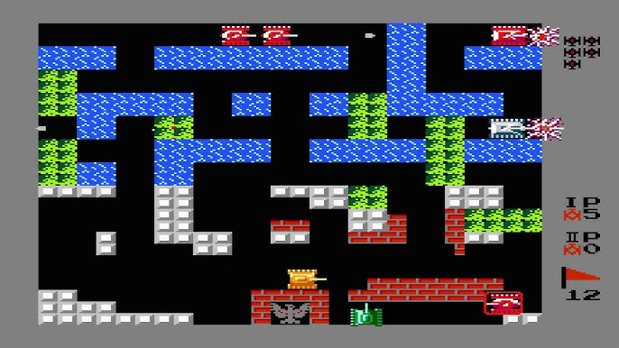
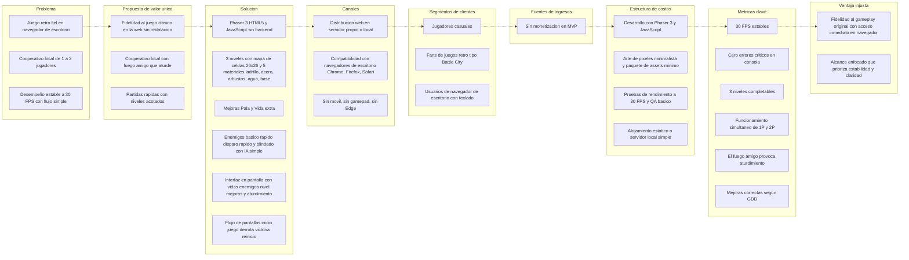
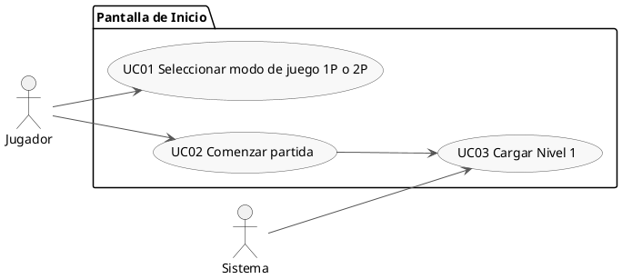
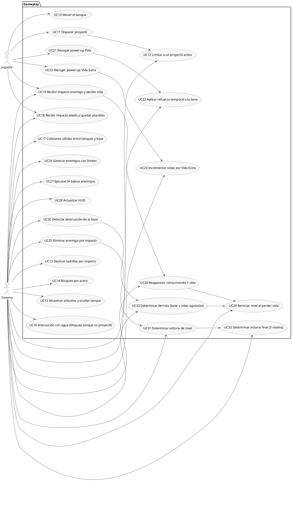
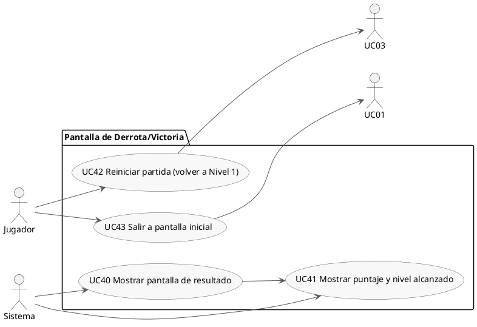
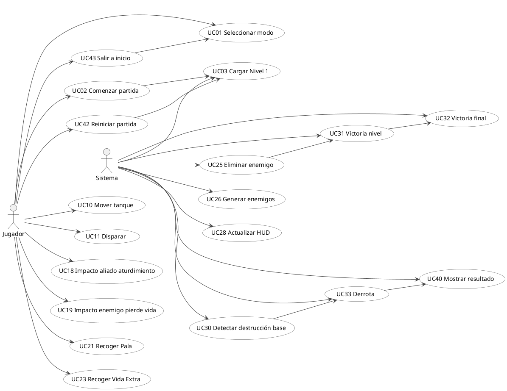
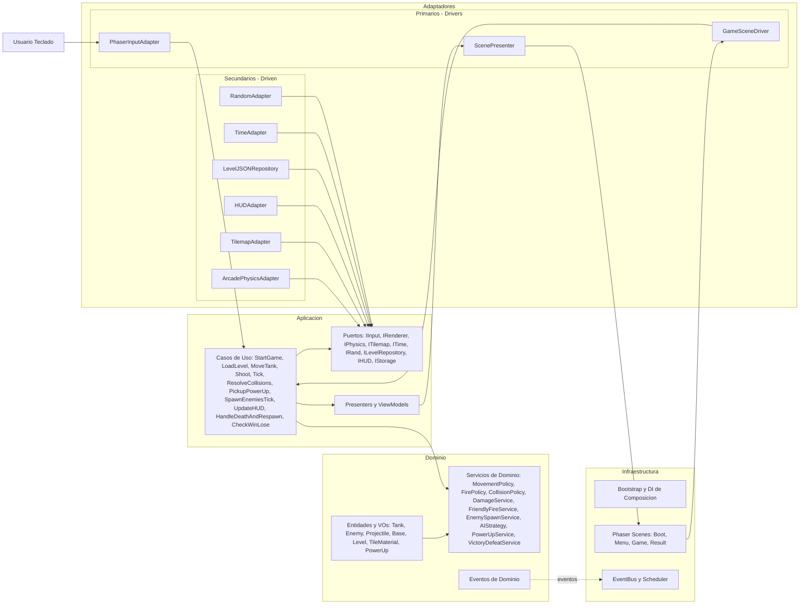

# 📘 Product Requirements Document (PRD) — Tank Defender (MVP)
**Rol:** Product Owner  
**Versión:** 1.1  
**Base:** GDD + decisiones aprobadas + stack confirmado  
**Objetivo:** Definir el “qué” y el “por qué” del MVP, complementando el GDD (que cubre el “cómo”).

---

# 1. Visión del Producto
Tank Defender es un juego web 2D inspirado en Battle City (Tank 1990), cuyo objetivo es recrear la experiencia clásica de defender la base del águila mientras uno o dos jugadores cooperan para eliminar tanques enemigos.  
El MVP será una demo jugable que prioriza fidelidad al gameplay original, compatibilidad web y desempeño estable en desktop.

**Imagen de referencia del menú del juego original:**


**Imagen de referencia del juego original:**


---

# 2. Objetivos del MVP
- Entregar una demo jugable con **3 niveles completos**.  
- Soportar **1 o 2 jugadores** en modo cooperativo.  
- Ejecutarse en navegador desktop a **30 FPS**.  
- Mantener un flujo simple: pantalla inicial → gameplay → derrota/victoria → reinicio o salida.  
- No incluye audio ni guardado.
- Diseño moderno pero minimalista, enfocado en funcionalidad y desempeño.

---

# 3. Público Objetivo
- Jugadores casuales.  
- Fans de juegos retro tipo Battle City.  
- Usuarios de navegador desktop con teclado.

---

# 4. Alcance del Modelo MVP
## Incluye
✔ Gameplay completo en 3 niveles  
✔ Modo 1P y 2P  
✔ Dos power-ups: Pala y Vida Extra  
✔ Friendly fire → aturdimiento  
✔ Escenarios con 5 tipos de material  
✔ Controles por teclado  
✔ 30 FPS estables  
✔ Pantallas: Inicio, Derrota/Victoria  
✔ No se guarda progreso  

## No Incluye
✘ Audio  
✘ Guardado local  
✘ Sistema de pausa  
✘ Mobile  
✘ Monetización  
✘ Sistemas avanzados (skins, upgrades, etc.)

---

# 5. Requerimientos Funcionales de Alto Nivel

## 5.1 Flujo Principal del Usuario
### **Pantalla de Inicio**
El usuario podrá:
- Seleccionar **1 jugador** o **2 jugadores**.  
- Presionar **“Comenzar”**.  
- Iniciar en **Nivel 1**.

### **Gameplay**
El jugador podrá:
- Moverse en 4 direcciones.  
- Disparar proyectiles.  
- Destruir enemigos o ladrillos.  
- Defender la base del águila.  
- Recoger power-ups.  
- Jugar cooperativamente.  
- Sufrir friendly fire (aturdimiento).

El sistema debe:
- Cargar uno de los 3 niveles.  
- Mantener el desempeño a 30 FPS.  
- Reiniciar el nivel al perder una vida.  
- Permitir continuar hasta agotar las 3 vidas.
- Por cada nivel, generar enemigos:
  - Nivel 1: 15 enemigos  
  - Nivel 2: 25 enemigos  
  - Nivel 3: 35 enemigos

### **Condición de Victoria**
- Completar los **3 niveles**.

### **Condición de Derrota**
- Base del águila destruida, o  
- Ambos jugadores sin vidas.

### **Pantalla de Derrota/Victoria**
Debe mostrar:
- Puntaje final  
- Nivel alcanzado  
- Botón **Reiniciar** → vuelve al nivel 1  
- Botón **Salir** → regresa a pantalla inicial  

La pantalla no debe bloquear el engine, solo el gameplay.

---

## 5.2 Controles

### **Jugador 1**
- W → arriba  
- A → izquierda  
- S → abajo  
- D → derecha  
- V → disparar  

### **Jugador 2**
- Flecha arriba → arriba  
- Flecha izquierda → izquierda  
- Flecha abajo → abajo  
- Flecha derecha → derecha  
- L → disparar  

---

## 5.3 Power-Ups del MVP
### **1. Pala / Shovel**
- Refuerza temporalmente la base del águila.  
- Duración especificada en GDD.

### **2. Vida Extra**
- Otorga +1 vida al jugador que la recoja.

---

## 5.4 Tipos de Materiales del Mapa
- **Ladrillo:** destructible.  
- **Acero:** indestructible.  
- **Arbustos:** decorativos, bloquean visión.  
- **Base del águila:** condición de derrota.  
- **Agua:** bloquea movimiento, no bloquea disparos.

---

## 5.5 Tipos de Enemigos
Incluye (según GDD):
- Estándar  
- Rápidos  
- Resistentes  

Con IA básica:
- Patrullaje  
- Persecución limitada  
- Disparo periódico

---

## 5.6 Friendly Fire
- Impactar un aliado lo deja **aturdido** por un tiempo.  
- No causa daño ni resta vidas.

---

# 6. Requerimientos Técnicos

## 6.1 Plataforma
- Navegadores desktop: Chrome, Firefox, Safari.  
- No soportado: Edge, Mobile, touch, gamepad.

---

## 6.2 Stack Tecnológico
- HTML5  
- CSS  
- JavaScript  
- **Phaser 3** (engine principal)  
- Servidor local simple (sin backend)

---

## 6.3 Requerimientos de Performance
- 30 FPS estables.  
- Sprites optimizados.  
- Tilemaps livianos.  
- IA simplificada.  
- Arcade Physics en Phaser 3.

---

## 6.4 Compatibilidad
- Sin instalación.  
- Sin guardado local.  
- Debe correr en servidor propio/local.

---

# 7. Riesgos y Consideraciones
| Riesgo | Impacto | Mitigación |
|--------|---------|------------|
| Colisiones múltiples | Medio | Dividir en grupos de colisión |
| IA pesada | Medio | Uso de máquinas de estado simples |
| Niveles muy grandes | Medio | Optimizar tilemaps |
| Sin sonido afecta percepción | Bajo | No aplica (decisión del MVP) |

---

# 8. Criterios de Aceptación del MVP
- 1P y 2P funcionan simultáneamente.  
- Los 3 niveles cargan correctamente.  
- Friendly fire genera aturdimiento.  
- Power-ups funcionan según GDD.  
- Base del águila provoca derrota al destruirse.  
- Gameplay estable a 30 FPS.  
- Pantalla de inicio → juego → derrota/victoria → reiniciar/salir.  
- Sin errores críticos en consola.  
- El MVP puede completarse en una sola sesión.

---

# 9. Entregables del MVP
- Carpeta `/dist` con el juego final.  
- Código fuente en Phaser 3.  
- Asset pack mínimo.  
- Documentación:
  - PRD  
  - GDD  
  - Setup local  
  - Controles y guía básica  

---

# 10. Diagrama Lean Canvas



# 11. Casos de Uso

## 11.1 Pantalla de Inicio

- UC01 Seleccionar modo de juego 1P o 2P – Actor: Jugador
- UC02 Comenzar partida – Actor: Jugador
- UC03 Cargar Nivel 1 – Actor: Sistema



## 11.2 Gameplay

- UC10 Mover el tanque en 4 direcciones con teclado – Actor: Jugador
- UC11 Disparar proyectil – Actor: Jugador
- UC12 Limitar a un proyectil activo por jugador – Actor: Sistema
- UC13 Impactar y destruir ladrillos – Actor: Sistema
- UC14 Bloqueo por acero a movimiento y disparos – Actor: Sistema
- UC15 Atravesar arbustos y ocultar visualmente al tanque – Actor: Sistema
- UC16 Bloqueo de movimiento por agua y permitir paso de disparos – Actor: Sistema
- UC17 Colisiones sólidas entre tanques y con la base – Actor: Sistema
- UC18 Recibir impacto aliado y quedar aturdido sin daño ni pérdida de vida – Actor: Jugador y Sistema
- UC19 Recibir impacto enemigo y perder vida – Actor: Jugador y Sistema
- UC20 Reaparecer en zona segura consumiendo 1 vida – Actor: Sistema
- UC21 Recoger power-up Pala – Actor: Jugador
- UC22 Aplicar refuerzo temporal a la base con Pala y revertir al finalizar – Actor: Sistema
- UC23 Recoger power-up Vida Extra – Actor: Jugador
- UC24 Incrementar contador de vidas por Vida Extra – Actor: Sistema
- UC25 Eliminar enemigo por impacto – Actor: Sistema
- UC26 Generar enemigos con límite simultáneo y total por nivel – Actor: Sistema
- UC27 Ejecutar IA básica de enemigos patrulla persecución limitada y disparo periódico – Actor: Sistema
- UC28 Actualizar HUD vidas enemigos restantes nivel power-up activo e indicador de aturdimiento – Actor: Sistema
- UC29 Reiniciar el nivel al perder una vida – Actor: Sistema
- UC30 Detectar destrucción de la base – Actor: Sistema
- UC31 Determinar victoria de nivel al eliminar todos los enemigos y avanzar – Actor: Sistema
- UC32 Determinar victoria final al completar los 3 niveles – Actor: Sistema
- UC33 Determinar derrota cuando la base es destruida o no hay vidas – Actor: Sistema



## 11.3 Pantalla de Derrota/Victoria
- UC40 Mostrar pantalla de resultado victoria o derrota – Actor: Sistema
- UC41 Mostrar puntaje final y nivel alcanzado – Actor: Sistema
- UC42 Reiniciar partida desde Nivel 1 – Actor: Jugador
- UC43 Salir a pantalla inicial – Actor: Jugador



## 11.4 Vision General



# 12. Diseño de la Arquitectura (Alto Nivel)

## 12.1 Explicación General del Diseño de la Arquitectura (Alto Nivel)
# Arquitectura de Alto Nivel — Tank Defender (MVP)
Clean Architecture + DDD, orientada a TDD, con Phaser 3 en la periferia.

## 1. Objetivo y Alcance
- MVP web 2D con 1–2 jugadores, 3 niveles, 30 FPS, teclado; sin backend ni audio (según PRD).
- Aislar reglas del juego del framework para facilitar pruebas, mantenibilidad y evolución.

## 2. Capas y Responsabilidades

### 2.1 Dominio (núcleo puro, sin dependencias de Phaser)
- Entidades y Value Objects
  - Tank (PlayerTank, EnemyTank), Projectile, Base, Level, Wave.
  - TileMaterial: Brick, Steel, Bush, Water, EagleBase.
  - PowerUp: Shovel, ExtraLife.
  - VOs: Position (grid 26×26), Direction, Speed, FireRate, Lives, Health, StunStatus, EnemyType, LevelId.
- Servicios/Políticas de Dominio (reglas puras)
  - MovementPolicy: movimiento 4 direcciones, límites del mapa, colisiones sólidas.
  - FirePolicy: 1 proyectil activo por jugador.
  - CollisionPolicy: sólidos vs. atravesables; balas y materiales.
  - DamageService: daño a enemigos y ladrillos; acero indestructible.
  - FriendlyFireService: aturdimiento 1.5–2 s sin daño.
  - EnemySpawnService: spawns fijos, máx. 4 simultáneos; total por nivel (según PRD/GDD).
  - PowerUpService: Shovel refuerza base por ventana temporal; ExtraLife suma 1 vida.
  - VictoryDefeatService: victoria por eliminar enemigos; derrota por base destruida o sin vidas.
  - AIStrategy: movimiento pseudoaleatorio con sesgo a la base; cadencia por tipo.
- Eventos de Dominio
  - ProjectileFired, BrickDestroyed, PlayerStunned, EnemyDestroyed, PlayerDied, BaseDamaged, PowerUpPicked, ShovelStarted, ShovelEnded, LevelCleared, GameOver.
- Beneficios
  - 100% testeable y determinista; no conoce Phaser ni APIs externas.

### 2.2 Aplicación (orquestación y casos de uso)
- Casos de uso (DTO de entrada → reglas de Dominio → ViewModels de salida)
  - StartGame, SelectMode, LoadLevel.
  - MoveTank, Shoot.
  - Tick (por frame), ResolveCollisions.
  - ApplyFriendlyFire, PickupPowerUp.
  - SpawnEnemiesTick, HandleDeathAndRespawn.
  - UpdateHUD, CheckWinLose, ShowResult.
- Puertos (interfaces para inversión de dependencias)
  - IInput, IRenderer, IPhysics, ITilemap, ITime, IRand, ILevelRepository, IHUD.
  - Reservados post-MVP: IAudio, IStorage.
- Presenters y ViewModels
  - HUDViewModel, SceneViewModel, DomainEventsOut.
- Reglas de dependencia
  - Aplicación depende solo de Dominio y de puertos; no conoce Phaser.

### 2.3 Adaptadores (concretan puertos y conectan con Phaser)
- Primarios (drivers)
  - KeyboardInputAdapter: mapea teclado a IInput.
  - GameSceneDriver: invoca casos de uso en el ciclo update de Phaser.
  - ScenePresenter: traduce ViewModels a objetos Phaser.
- Secundarios (driven)
  - ArcadePhysicsAdapter: overlaps/queries AABB.
  - TilemapAdapter: lectura de materiales del tilemap.
  - HUDAdapter: textos y contadores.
  - LevelJSONRepository: carga niveles y oleadas desde JSON.
  - TimeAdapter: delta, temporizadores controlados.
  - RandomAdapter: PRNG seedable para tests.
- Mapeo a Phaser 3
  - Phaser se limita a render, input, física arcade y tiempo, encapsulado en adaptadores.

### 2.4 Infraestructura (composición y runtime)
- Bootstrap y DI
  - Composition Root crea instancias, cablea puertos→adaptadores, construye escenas.
- Escenas Phaser
  - Boot (precarga), Menu (1P/2P), Game (loop), Result (victoria/derrota).
- EventBus ligero
  - Suscribe eventos de dominio para efectos visuales sin lógica de juego.
- Datos
  - Niveles y waves en JSON estático; estado de partida en memoria; sin backend.

## 3. Bounded Contexts (DDD pragmático para MVP)
- Core Gameplay: movimiento, disparo, colisiones, vidas, base.
- Enemies & AI: tipos, estrategias, spawn.
- Level & Map: materiales, spawns, reglas de terreno.
- PowerUps: Shovel y ExtraLife.
- HUD: vidas, enemigos restantes, nivel, estados (stun, power-up activo).

## 4. Ciclo de Actualización (Game Loop)
1. Leer input vía IInput.
2. MoveTank y Shoot según input.
3. Tick: avanzar timers y estados (stun, shovel, cadencias).
4. ResolveCollisions: proyectiles, materiales, entidades.
5. ApplyFriendlyFire y DamageService.
6. SpawnEnemiesTick respetando límites (simultáneo y total).
7. CheckWinLose y HandleDeathAndRespawn.
8. UpdateHUD y presentar con ScenePresenter.

## 5. Cumplimiento de Principios
- Clean Architecture: dependencias apuntan al Dominio; adaptadores e infraestructura dependen de puertos.
- DDD: entidades ricas, políticas de dominio, eventos, lenguaje ubicuo.
- SOLID
  - SRP: casos de uso atómicos; servicios por política.
  - OCP: nuevos enemigos o power-ups se agregan vía estrategias sin modificar núcleo.
  - LSP: estrategias de IA intercambiables respetando contrato.
  - ISP: puertos granulares (IInput, ITime, IPhysics, ITilemap).
  - DIP: Dominio y Aplicación dependen de abstracciones.
- KISS/YAGNI: Arcade Physics, FSM simple de IA; sin ECS ni redes en el MVP.
- TDD: Dominio puro, tiempo/azar inyectables; adapters testeados por contratos.

## 6. Requisitos No Funcionales
- Escalabilidad
  - Niveles y oleadas por JSON; nuevos enemigos/power-ups como estrategias.
  - Pooling de proyectiles/enemigos; orden determinista de sistemas.
- Seguridad
  - Assets y niveles estáticos (lista blanca), sin eval; CSP recomendable.
  - Input mapeado y validado; límites a spawns y proyectiles.
- Mantenibilidad
  - Capas claras, puertos pequeños, DI centralizado, tests unitarios en Dominio.
  - Convenciones de módulo y nombres alineadas al dominio.
- Alta disponibilidad
  - Hosting estático, precarga de assets, recuperación a Menu ante errores de escena.
  - Sin dependencia de red en ejecución.

## 7. Estructura de Carpetas Sugerida
```
src/
  domain/
    core/
      entities/
      value-objects/
      services/
      events/
    enemies/
    level/
    powerups/
    hud/
  application/
    use-cases/
    ports/
    viewmodels/
  adapters/
    phaser/
      input/
      physics/
      tilemap/
      hud/
      presenter/
      drivers/
    repositories/
      level-json/
    time/
    random/
  infrastructure/
    di/
    scenes/
    config/
    eventbus/
assets/
  tilesets/
  levels/
  sprites/
tests/
  domain/
  application/
  contracts/
```

## 8. Puertos esenciales (resumen)
- IInput: getAxis(playerId), isFirePressed(playerId).
- IPhysics: overlaps, raycasts, bodies AABB.
- ITilemap: getMaterialAt(gridPos), isSolid(material), isBulletBlocking(material).
- ITime: now, delta, setTimeout, setInterval (cancelables).
- IRand: nextFloat, nextInt, reseed.
- ILevelRepository: loadLevel(levelId) → { tilemap, spawns, waves }.
- IHUD: setLives(p1, p2), setEnemiesRemaining(count), setLevel(id), setStatuses(states).
- IRenderer: bind sprites, play animations, setVisibility, z-order.

## 9. Estrategia de Pruebas
- Unit (Dominio): MovementPolicy, FirePolicy, CollisionPolicy, FriendlyFireService, PowerUpService, VictoryDefeatService, AIStrategy.
- Unit (Aplicación): Tick, ResolveCollisions, SpawnEnemiesTick, HandleDeathAndRespawn.
- Contract: ArcadePhysicsAdapter, TilemapAdapter, LevelJSONRepository contra interfaces.
- Integración ligera: GameSceneDriver con stubs de ITime/IPhysics/ITilemap.

## 10. Notas de Implementación con Phaser 3
- Usar Arcade Physics para detección; la resolución final la decide Dominio.
- Capas del tilemap: sólidos (brick, steel, eagle), visuales (bush con z alto), agua bloquea tanques pero deja pasar balas.
- Pools de proyectiles y enemigos para performance.
- El render depende de ViewModels; no filtrar objetos Phaser al Dominio.

## 11. Alineación con PRD y GDD
- 1–2 jugadores, friendly fire con aturdimiento, 3 niveles, 30 FPS.
- Materiales: ladrillo, acero, arbusto, agua, base de águila.
- Enemigos: básico, rápido, disparo rápido, blindado; spawn fijo con límite simultáneo y total.
- Power-ups: Shovel (refuerzo temporal) y ExtraLife.
- Flujo: Menu → Game → Result; sin audio ni guardado en MVP.

## 12.2 Diagrama de la arquitectura (Alto nivel)


## 13. Diagramas C4 

### 13.1 Diagrama de Contexto del Sistema
```plantuml
@startuml C4_Elements
!include https://raw.githubusercontent.com/plantuml-stdlib/C4-PlantUML/master/C4_Container.puml

Person(player, "Jugador", "Usuario de navegador desktop con teclado")
System(td, "Tank Defender (MVP)", "Juego web 2D tipo Battle City, 3 niveles, 1–2 jugadores")
System(web, "Servidor Web Estático", "Aloja y sirve HTML, JS, CSS, sprites, tilemaps y JSON de niveles")

Rel(player, td, "Juega con teclado", "WASD/V y Flechas/L")
Rel(td, web, "Descarga/consulta assets y niveles (GET)", "HTTP")

@enduml
```

## 13.2 Diagrama de Contenedores
```plantuml
@startuml C4_Elements
!include https://raw.githubusercontent.com/plantuml-stdlib/C4-PlantUML/master/C4_Container.puml

Person(player, "Jugador", "Navegador desktop con teclado")

System(web, "Servidor Web Estático", "Aloja HTML/JS/CSS, sprites, tilemaps, JSON de niveles")

System_Boundary(td_boundary, "Tank Defender (MVP)") {
  Container(spa, "Cliente Web (SPA Phaser 3)", "HTML5, CSS, JavaScript, Phaser 3", "Gameplay, escenas (Inicio/Juego/Resultado), HUD, física Arcade; sin backend")
}

Rel(player, spa, "Juega con teclado", "WASD/V y Flechas/L")
Rel(spa, web, "GET de HTML/CSS/JS/Assets/JSON", "HTTP")

@enduml
```

## 13.3 Diagrama de Componentes
```plantuml
@startuml C4_Elements
!include https://raw.githubusercontent.com/plantuml-stdlib/C4-PlantUML/master/C4_Container.puml

' Contenedor principal: SPA
Container(spa, "Cliente Web (SPA Phaser 3)", "HTML5/JS", "Ejecuta el juego en el navegador")

' Capas núcleo
Container(domainCore, "Dominio", "TS/JS puro", "Entidades, VOs y políticas: movimiento, disparo, colisiones, friendly fire, power-ups, spawn, IA básica")
Container(appLayer, "Aplicación", "TS/JS puro", "Casos de uso: StartGame, LoadLevel, Tick, Spawn, CheckWin/Lose, UpdateHUD")

' Adaptadores (puertos)
Container(inputAdapter, "KeyboardInputAdapter", "Phaser Input → IInput", "Mapea teclado a acciones por jugador")
Container(physicsAdapter, "ArcadePhysicsAdapter", "Phaser Arcade → IPhysics", "Overlaps/queries AABB")
Container(tilemapAdapter, "TilemapAdapter", "Phaser Tilemap → ITilemap", "Materiales: ladrillo, acero, arbusto, agua, base")
Container(renderer, "ScenePresenter & HUD", "Phaser → IRenderer/IHUD", "Render sprites, HUD (vidas, enemigos, nivel, estados)")
Container(randAdapter, "RandomAdapter", "PRNG → IRand", "Determinismo seedable para TDD")
Container(timeAdapter, "TimeAdapter", "Phaser.Time → ITime", "Timers y delta time")
Container(levelRepo, "LevelJSONRepository", "fetch JSON → ILevelRepository", "Carga tilemaps y waves")

' Infraestructura
Container(scenes, "Escenas Phaser", "Phaser 3 Scenes", "Boot, Menu, Game, Result")
Container(eventBus, "EventBus", "TS/JS", "Suscripción a eventos de dominio para efectos visuales")
Container(compRoot, "Composition Root (DI)", "TS/JS", "Bootstrap, cableado de puertos y escenas")

' Relaciones principales
Rel(compRoot, scenes, "Crea y configura escenas")
Rel(compRoot, appLayer, "Inyecta puertos")
Rel(compRoot, domainCore, "Inyecta en casos de uso")
Rel(compRoot, inputAdapter, "Registra input")
Rel(compRoot, renderer, "Configura presentación/HUD")
Rel(compRoot, physicsAdapter, "Configura física")
Rel(compRoot, tilemapAdapter, "Configura tilemap")
Rel(compRoot, timeAdapter, "Configura tiempo")
Rel(compRoot, randAdapter, "Configura PRNG")
Rel(compRoot, levelRepo, "Configura repositorio de niveles")

Rel(scenes, inputAdapter, "Lee entrada")
Rel(scenes, renderer, "Dibuja sprites/HUD")
Rel(scenes, physicsAdapter, "Consulta colisiones")
Rel(scenes, tilemapAdapter, "Consulta materiales")
Rel(scenes, timeAdapter, "Timers/delta")

Rel(appLayer, domainCore, "Orquesta reglas de juego")
Rel(appLayer, renderer, "Actualiza HUD/escena")
Rel(appLayer, inputAdapter, "Lee IInput")
Rel(appLayer, physicsAdapter, "Usa IPhysics")
Rel(appLayer, tilemapAdapter, "Usa ITilemap")
Rel(appLayer, timeAdapter, "Usa ITime")
Rel(appLayer, randAdapter, "Usa IRand")
Rel(appLayer, levelRepo, "Carga niveles/waves")

Rel(domainCore, eventBus, "Emite eventos de dominio")
Rel(eventBus, renderer, "Dispara efectos visuales")

' Interacción jugador
Person(player, "Jugador", "WASD/V y Flechas/L")
Rel(player, scenes, "Interacción en tiempo real", "Teclado")
@enduml
```

## 14 